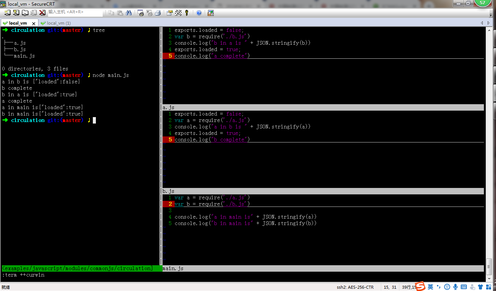
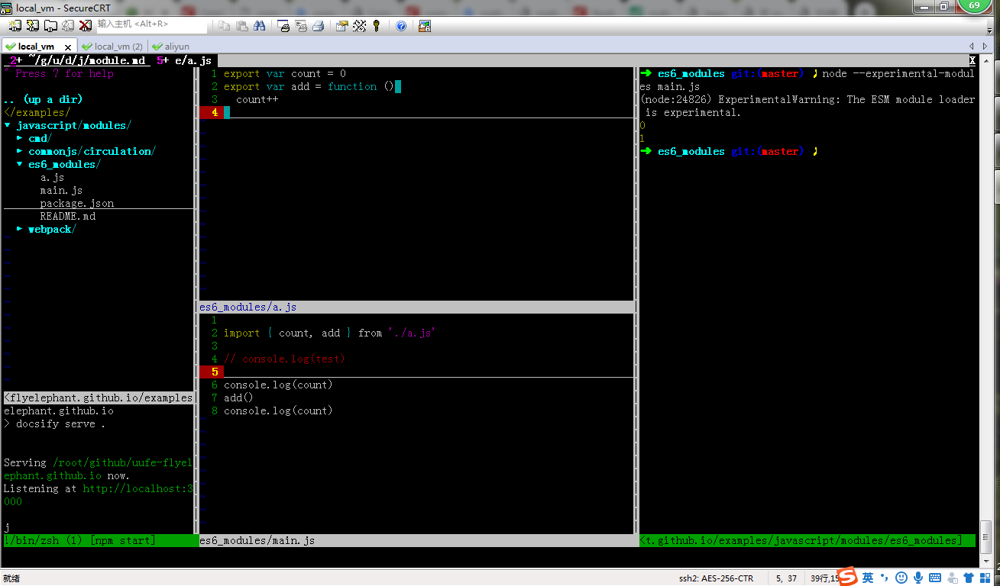

# CommonJS

## 特点
* 对于基本数据类型，属于复制。即会被模块缓存。同时，在另一个模块可以对该模块输出的变量重新赋值。
* 对于复杂数据类型，属于浅拷贝。由于两个模块引用的对象指向同一个内存空间，因此对该模块的值做修改时会影响另一个模块。
* 当使用require命令加载某个模块时，就会运行整个模块的代码。
* 当使用require命令加载同一个模块时，不会再执行该模块，而是取到缓存之中的值。也就是说，CommonJS模块无论加载多少次，都只会在第一次加载时运行一次，以后再加载，就返回第一次运行的结果，除非手动清除系统缓存。
* 循环加载时，属于加载时执行。即脚本代码在require的时候，就会全部执行。一旦出现某个模块被"循环加载"，就只输出已经执行的部分，还未执行的部分不会输出。

## 循环引用
若出现循环引用，就只执行已经输出的（exports）部分，其他的未导出的不管。  



## 值引用 --其实是复制
``` javascript
// b.js
let count = 1
let plusCount = () => {
  count++
}
setTimeout(() => {
  console.log('b.js-1', count)
}, 1000)
module.exports = {
  count,
  plusCount
}

// a.js
let mod = require('./b.js')
console.log('a.js-1', mod.count)
mod.plusCount()
console.log('a.js-2', mod.count)
setTimeout(() => {
    mod.count = 3
    console.log('a.js-3', mod.count)
}, 2000)

node a.js
a.js-1 1
a.js-2 1
b.js-1 2  // 1秒后
a.js-3 3  // 2秒后
```
## 精简实现
[github](https://github.com/ruanyf/tiny-browser-require)
``` javascript
// Usage
//
//   require.register("browser/debug.js", function(module, exports, require){
//     // Module code goes here
//   });
//
//   var debug = require("browser/debug.js");

function require(p){
  var path = require.resolve(p);
  var mod = require.modules[path];
  if (!mod) throw new Error('failed to require "' + p + '"');
  if (!mod.exports) {
    mod.exports = {};
    mod.call(mod.exports, mod, mod.exports, require.relative(path));
  }
  return mod.exports;
}

require.modules = {};

require.resolve = function (path){
  var orig = path;
  var reg = path + '.js';
  var index = path + '/index.js';
  return require.modules[reg] && reg
    || require.modules[index] && index
    || orig;
};

require.register = function (path, fn){
  require.modules[path] = fn;
};

require.relative = function (parent) {
  return function(p){
    if ('.' != p.charAt(0)) return require(p);
    var path = parent.split('/');
    var segs = p.split('/');
    path.pop();

    for (var i = 0; i < segs.length; i++) {
      var seg = segs[i];
      if ('..' == seg) path.pop();
      else if ('.' != seg) path.push(seg);
    }

    return require(path.join('/'));
  };
};
```


# ES6 Module

## 特点
* ES6模块中的值属于【动态只读引用】。
* 对于只读来说，即不允许修改引入变量的值，import的变量是只读的，不论是基本数据类型还是复杂数据类型。当模块遇到import命令时，就会生成一个只读引用。等到脚本真正执行时，再根据这个只读引用，到被加载的那个模块里面去取值。
* 对于动态来说，原始值发生变化，import加载的值也会发生变化。不论是基本数据类型还是复杂数据类型。
* 循环加载时，ES6模块是动态引用。只要两个模块之间存在某个引用，代码就能够执行。

## 值引用



## 循环引用
```javascript
// b.js
import {foo} from './a.js';
export function bar() {
  console.log('bar');
  if (Math.random() > 0.5) {
    foo();
  }
}

// a.js
import {bar} from './b.js';
export function foo() {
  console.log('foo');
  bar();
  console.log('执行完毕');
}
foo();

babel-node a.js
foo
bar
执行完毕

// 执行结果也有可能是
foo
bar
foo
bar
执行完毕
执行完毕
```

# webpack
webpack打包生成的代码，读一下  
```
/******/ (function(modules) { // webpackBootstrap
/******/ 	// The module cache
/******/ 	var installedModules = {};
/******/
/******/ 	// The require function
/******/ 	function __webpack_require__(moduleId) {
/******/
/******/ 		// Check if module is in cache
/******/ 		if(installedModules[moduleId]) {
/******/ 			return installedModules[moduleId].exports;
/******/ 		}
/******/ 		// Create a new module (and put it into the cache)
/******/ 		var module = installedModules[moduleId] = {
/******/ 			i: moduleId,
/******/ 			l: false,
/******/ 			exports: {}
/******/ 		};
/******/
/******/ 		// Execute the module function
/******/ 		modules[moduleId].call(module.exports, module, module.exports, __webpack_require__);
/******/
/******/ 		// Flag the module as loaded
/******/ 		module.l = true;
/******/
/******/ 		// Return the exports of the module
/******/ 		return module.exports;
/******/ 	}
/******/
/******/
/******/ 	// expose the modules object (__webpack_modules__)
/******/ 	__webpack_require__.m = modules;
/******/
/******/ 	// expose the module cache
/******/ 	__webpack_require__.c = installedModules;
/******/
/******/ 	// define getter function for harmony exports
/******/ 	__webpack_require__.d = function(exports, name, getter) {
/******/ 		if(!__webpack_require__.o(exports, name)) {
/******/ 			Object.defineProperty(exports, name, { enumerable: true, get: getter });
/******/ 		}
/******/ 	};
/******/
/******/ 	// define __esModule on exports
/******/ 	__webpack_require__.r = function(exports) {
/******/ 		if(typeof Symbol !== 'undefined' && Symbol.toStringTag) {
/******/ 			Object.defineProperty(exports, Symbol.toStringTag, { value: 'Module' });
/******/ 		}
/******/ 		Object.defineProperty(exports, '__esModule', { value: true });
/******/ 	};
/******/
/******/ 	// create a fake namespace object
/******/ 	// mode & 1: value is a module id, require it
/******/ 	// mode & 2: merge all properties of value into the ns
/******/ 	// mode & 4: return value when already ns object
/******/ 	// mode & 8|1: behave like require
/******/ 	__webpack_require__.t = function(value, mode) {
/******/ 		if(mode & 1) value = __webpack_require__(value);
/******/ 		if(mode & 8) return value;
/******/ 		if((mode & 4) && typeof value === 'object' && value && value.__esModule) return value;
/******/ 		var ns = Object.create(null);
/******/ 		__webpack_require__.r(ns);
/******/ 		Object.defineProperty(ns, 'default', { enumerable: true, value: value });
/******/ 		if(mode & 2 && typeof value != 'string') for(var key in value) __webpack_require__.d(ns, key, function(key) { return value[key]; }.bind(null, key));
/******/ 		return ns;
/******/ 	};
/******/
/******/ 	// getDefaultExport function for compatibility with non-harmony modules
/******/ 	__webpack_require__.n = function(module) {
/******/ 		var getter = module && module.__esModule ?
/******/ 			function getDefault() { return module['default']; } :
/******/ 			function getModuleExports() { return module; };
/******/ 		__webpack_require__.d(getter, 'a', getter);
/******/ 		return getter;
/******/ 	};
/******/
/******/ 	// Object.prototype.hasOwnProperty.call
/******/ 	__webpack_require__.o = function(object, property) { return Object.prototype.hasOwnProperty.call(object, property); };
/******/
/******/ 	// __webpack_public_path__
/******/ 	__webpack_require__.p = "";
/******/
/******/
/******/ 	// Load entry module and return exports
/******/ 	return __webpack_require__(__webpack_require__.s = 0);
/******/ })
/************************************************************************/
/******/ ([
/* 0 */
/***/ (function(module, __webpack_exports__, __webpack_require__) {

"use strict";
__webpack_require__.r(__webpack_exports__);
/* harmony import */ var _test_js__WEBPACK_IMPORTED_MODULE_0__ = __webpack_require__(1);


/***/ }),
/* 1 */
/***/ (function(module, __webpack_exports__, __webpack_require__) {

"use strict";
__webpack_require__.r(__webpack_exports__);
/* harmony export (binding) */ __webpack_require__.d(__webpack_exports__, "default", function() { return add; });
/* harmony export (binding) */ __webpack_require__.d(__webpack_exports__, "a", function() { return a; });
function add() {
  return 12;
}
var a = 12;

/***/ })
/******/ ]);

```