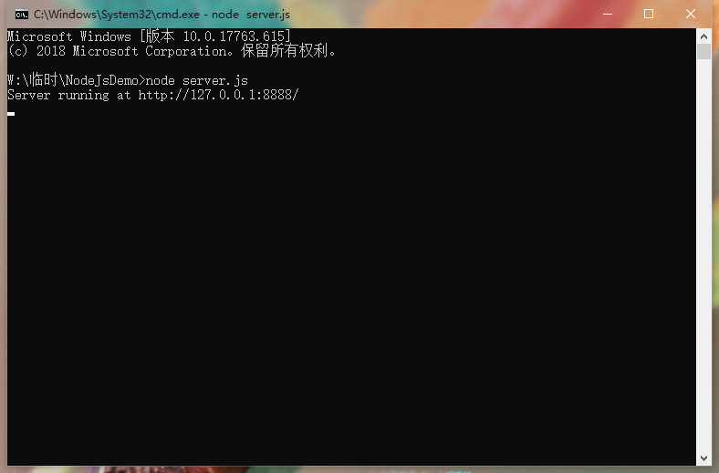
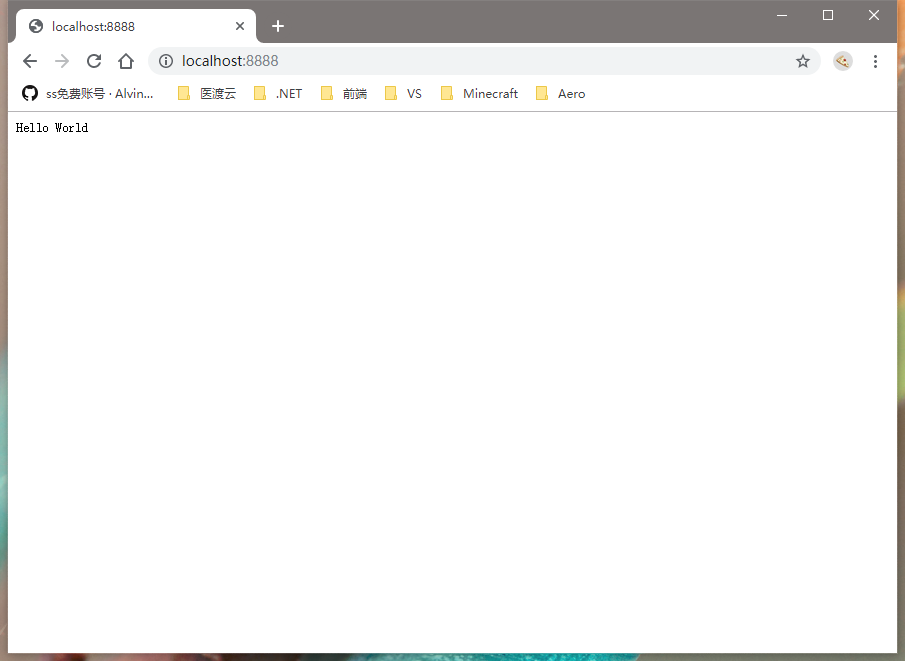

## Node.js 创建第一个应用

如果我们使用PHP来编写后端的代码时，需要Apache 或者 Nginx 的HTTP 服务器，并配上 mod_php5 模块和php-cgi。

从这个角度看，整个"接收 HTTP 请求并提供 Web 页面"的需求根本不需 要 PHP 来处理。

不过对 Node.js 来说，概念完全不一样了。使用 Node.js 时，我们不仅仅 在实现一个应用，同时还实现了整个 HTTP 服务器。事实上，我们的 Web 应用以及对应的 Web 服务器基本上是一样的。

在我们创建 Node.js 第一个 "Hello, World!" 应用前，让我们先了解下 Node.js 应用是由哪几部分组成的：

1. 引入 required 模块：我们可以使用 require 指令来载入 Node.js 模块。

2. 创建服务器：服务器可以监听客户端的请求，类似于 Apache 、Nginx 等 HTTP 服务器。

3. 接收请求与响应请求 服务器很容易创建，客户端可以使用浏览器或终端发送 HTTP 请求，服务器接收请求后返回响应数据。


## 创建 Node.js 应用

#### 步骤一、引入 required 模块

我们使用 require 指令来载入 http 模块，并将实例化的 HTTP 赋值给变量 http，实例如下:
```
var http = require("http");
```

#### 步骤二、创建服务器

接下来我们使用 http.createServer() 方法创建服务器，并使用 listen 方法绑定 8888 端口。 函数通过 request, response 参数来接收和响应数据。

实例如下，在你项目的根目录下创建一个叫 server.js 的文件，并写入以下代码：

```
var http = require('http');

http.createServer(function (request, response) {

    // 发送 HTTP 头部 
    // HTTP 状态值: 200 : OK
    // 内容类型: text/plain
    response.writeHead(200, {'Content-Type': 'text/plain'});

    // 发送响应数据 "Hello World"
    response.end('Hello World\n');
}).listen(8888);

// 终端打印如下信息
console.log('Server running at http://127.0.0.1:8888/');
```

以上代码我们完成了一个可以工作的 HTTP 服务器。

使用 node 命令执行以上的代码：

```
node server.js
Server running at http://127.0.0.1:8888/
```



接下来，打开浏览器访问 http://127.0.0.1:8888/ ，你会看到一个写着 "Hello World"的网页。



分析Node.js 的 HTTP 服务器：

- 第一行请求（require）Node.js 自带的 http 模块，并且把它赋值给 http 变量。
- 接下来我们调用 http 模块提供的函数： createServer 。这个函数会返回 一个对象，这个对象有一个叫做 listen 的方法，这个方法有一个数值参数， 指定这个 HTTP 服务器监听的端口号。
